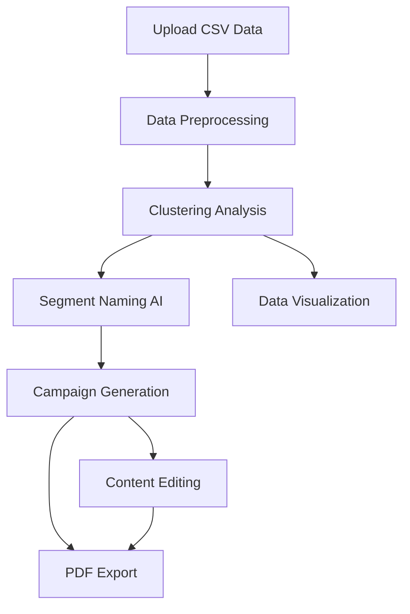

# Zaplanuj.to - AI Marketing Tool

[](https://zaplanujto.streamlit.app/)
[](https://github.com/skwarlinski/Zaplanuj.to)
[](https://python.org)
[](https://streamlit.io)

## Opis projektu

**Zaplanuj.to** to zaawansowana aplikacja webowa wykorzystująca sztuczną inteligencję do automatyzacji tworzenia kampanii marketingowych. Projekt łączy machine learning z generatywną AI, umożliwiając marketerom i analitykom tworzenie spersonalizowanych komunikatów reklamowych na podstawie segmentacji klientów.

!!! tip "Kluczowe zalety"
    🎯 **Automatyczna segmentacja** - Klasteryzacja klientów bez nadzoru  
    🧠 **AI-powered content** - Generowanie kampanii przez GPT-4  
    📊 **Wizualizacja danych** - Interaktywne wykresy i analizy  
    📋 **Export do PDF** - Profesjonalne raporty kampanii

## Demo aplikacji

Wypróbuj aplikację na żywo: **[zaplanujto.streamlit.app](https://zaplanujto.streamlit.app/)**

## Funkcjonalności

Aplikacja oferuje kompletny workflow automatyzacji kampanii marketingowych, od analizy danych po gotowe materiały reklamowe.

!!! info "Główne moduły aplikacji"
    **📊 Data Processing** → **🤖 ML Clustering** → **🎯 AI Campaign Generation** → **📋 Export & Reports**

### 📊 Przetwarzanie i analiza danych

Zaawansowany system importu i walidacji danych klientów z automatyczną analizą eksploracyjną.

- **📁 Elastyczny import**
    - Wczytywanie plików CSV z walidacją struktury
    - Ręczne wprowadzanie danych przez interfejs
    - Obsługa różnych formatów i kodowań
    
- **🔍 Inteligentna walidacja**
    - Automatyczne wykrywanie typów danych
    - Identyfikacja brakujących wartości
    - Sugestie poprawek i czyszczenia danych
    
- **📈 Analiza eksploracyjna**
    - Statystyki opisowe wszystkich zmiennych
    - Korelacje między cechami klientów
    - Rozkłady wartości z wizualizacjami

### 🤖 Machine Learning i segmentacja

Wykorzystanie algorytmów uczenia maszynowego do inteligentnej segmentacji klientów.

- **🎯 Zaawansowana klasteryzacja**
    - Algorytm K-means z optymalizacją liczby klastrów
    - Metoda łokcia i Silhouette Score
    - Automatyczne skalowanie i normalizacja danych
    
- **📐 Redukcja wymiarowości**
    - Principal Component Analysis (PCA)
    - Wizualizacja w przestrzeni 2D/3D
    - Zachowanie maksymalnej wariancji danych
    
- **⚡ Optymalizacja wydajności**
    - Inteligentne próbkowanie dla dużych zbiorów
    - Cache'owanie wyników pośrednich
    - Równoległe przetwarzanie algorytmów

### 🎯 Generowanie kampanii AI

Wykorzystanie GPT-4 do tworzenia spersonalizowanych kampanii marketingowych dla każdego segmentu.

- **🏷️ Inteligentne nazewnictwo**
    - AI generuje nazwy segmentów na podstawie charakterystyk
    - Opisy grup docelowych w języku biznesowym
    - Personalizacja dla branży i kontekstu
    
- **📝 Kampanie wielokanałowe**
    - **Social Media**: Posty na Facebook, Instagram, LinkedIn
    - **Email Marketing**: Tematy i treści maili
    - **Display Ads**: Slogany i kreacje reklamowe
    - **Content Marketing**: Artykuły i blogi
    
- **🎨 Dostosowanie stylu**
    - Wybór tonu komunikacji (profesjonalny, casualowy, emocjonalny)
    - Dopasowanie do branży i grupy docelowej
    - Wersje A/B dla testowania skuteczności

### 📋 Eksport i raportowanie

Profesjonalne raporty i możliwość eksportu wszystkich wyników w różnych formatach.

- **📄 Raporty PDF**
    - Kompletne kampanie z wszystkimi wariantami
    - Charakterystyki segmentów z wykresami
    - Branding i profesjonalna prezentacja
    
- **📊 Wizualizacje interaktywne**
    - Wykresy rozkładu klastrów z Plotly
    - Heatmapy cech charakterystycznych
    - Dashboardy z kluczowymi metrykami
    
- **✏️ Edycja i personalizacja**
    - Modyfikacja wygenerowanych treści w czasie rzeczywistym
    - Zapisywanie własnych wersji kampanii
    - Historia zmian i wersjonowanie

## Stack technologiczny

=== "Backend & ML"
    
    - **Streamlit** - Framework webowy
    - **PyCaret** - AutoML i klasteryzacja 
    - **Pandas** - Przetwarzanie danych
    - **Scikit-learn** - Algorytmy ML
    - **Matplotlib** - Wizualizacja danych

=== "AI & NLP"
    
    - **OpenAI GPT-4o** - Generowanie treści
    - **LangChain** - Orchestracja AI workflows
    - **Prompt Engineering** - Optymalizacja zapytań

=== "UI & UX"
    
    - **Streamlit Components** - Interaktywne elementy
    - **Lottie Animations** - Animacje JSON
    - **Material Design** - Nowoczesny interfejs
    - **Responsive Layout** - Adaptacja mobilna

=== "Export & Reports"
    
    - **ReportLab** - Generowanie PDF
    - **Plotly** - Interaktywne wykresy
    - **Streamlit-Download** - Pobieranie plików

## Architektura rozwiązania



## Proces działania

1. **📤 Import danych** - Użytkownik wczytuje dane klientów (CSV lub manual)
2. **🔍 Analiza eksploracyjna** - Automatyczne podsumowanie i walidacja
3. **🎯 Klasteryzacja** - ML segmentuje klientów na grupy
4. **🤖 AI Naming** - GPT-4 generuje nazwy i opisy segmentów  
5. **📝 Kampanie** - Tworzenie spersonalizowanych komunikatów
6. **✏️ Edycja** - Możliwość modyfikacji wyników
7. **📊 Wizualizacja** - Wykresy i statystyki segmentów
8. **📋 Export** - Pobieranie kampanii jako PDF

## Przykłady zastosowań

!!! example "Use Cases"
    
    **E-commerce** - Segmentacja klientów online sklepu na podstawie historii zakupów
    
    **SaaS** - Grupowanie użytkowników według wzorców użytkowania
    
    **Finance** - Klasyfikacja klientów bankowych dla produktów finansowych
    
    **Healthcare** - Segmentacja pacjentów dla kampanii profilaktycznych

## Metryki i wyniki

- ⚡ **Szybkość przetwarzania**: < 30 sekund dla 10k rekordów
- 🎯 **Dokładność klasteryzacji**: Silhouette Score > 0.6
- 🚀 **Performance**: 99% uptime na Streamlit Cloud
- 👥 **User Experience**: Intuicyjny interfejs, 0 onboardingu

## Uruchomienie lokalne

```bash
# Klonowanie repozytorium
git clone https://github.com/skwarlinski/Zaplanuj.to.git
cd Zaplanuj.to

# Instalacja zależności
pip install -r requirements.txt

# Konfiguracja API key (OpenAI)
echo "OPENAI_API_KEY=your_key_here" > .env

# Uruchomienie aplikacji
streamlit run app.py
```

## Przyszłe rozszerzenia

- [ ] **Multi-language support** - Obsługa innych języków
- [ ] **Advanced ML models** - DBSCAN, Gaussian Mixture
- [ ] **Real-time data** - Integracja z CRM/Analytics
- [ ] **A/B Testing** - Porównywanie skuteczności kampanii
- [ ] **API endpoints** - RESTful API dla integracji
- [ ] **Database integration** - PostgreSQL/MongoDB storage

## Kontakt i feedback

Masz pytania o projekt lub chcesz współpracować? Skontaktuj się ze mną:

- 💼 [LinkedIn](https://www.linkedin.com/in/hubert-skwarlinski-895437368/)
- 💻 [GitHub](https://github.com/skwarlinski)
- ✉️ [Email](mailto:skwarlinskihubert@gmail.com)

---

*Projekt dostępny na licencji MIT - możesz używać, kopiować i rozwijać aplikację na własne potrzeby.*